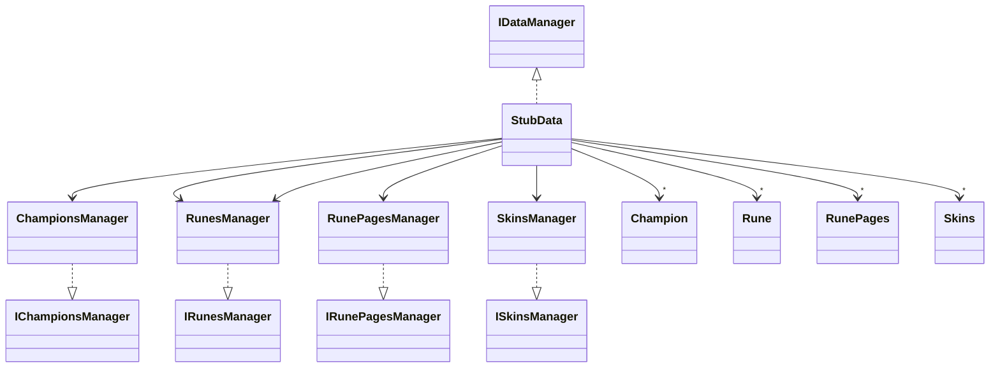

## Diagramme de classes simplifié du Stub

```mermaid
classDiagram
direction TB;

IDataManager <|.. StubData

ChampionsManager ..|> IChampionsManager
StubData --> ChampionsManager

RunesManager ..|> IRunesManager
StubData --> RunesManager

RunePagesManager ..|> IRunePagesManager
StubData --> RunePagesManager

SkinsManager ..|> ISkinsManager
StubData --> SkinsManager

StubData --> RunesManager
StubData --> "*" Champion
StubData --> "*" Rune
StubData --> "*" RunePages
StubData --> "*" Skins
```
